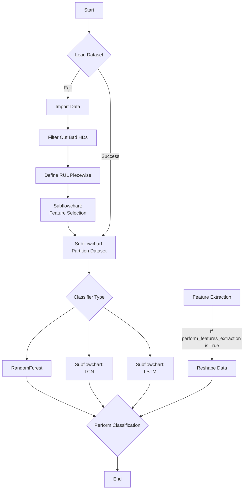
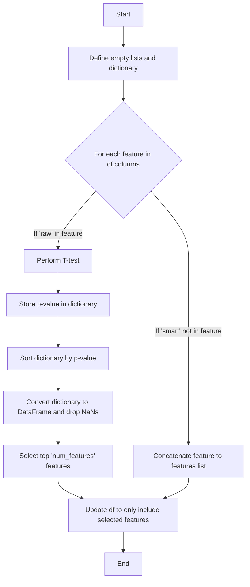
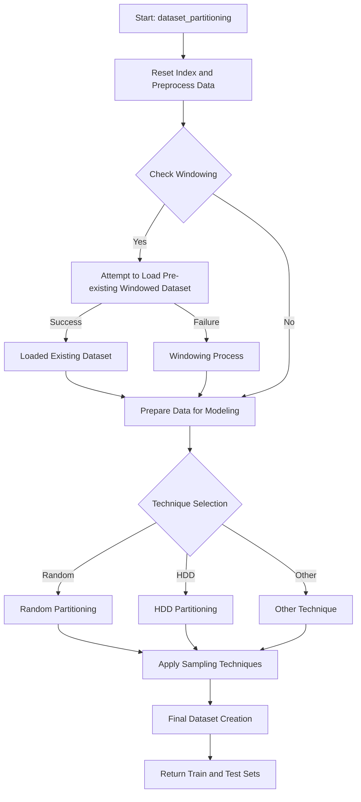
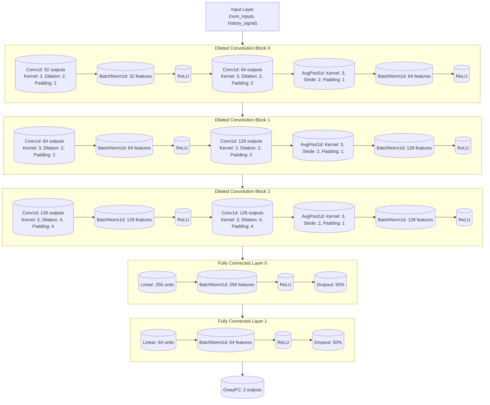
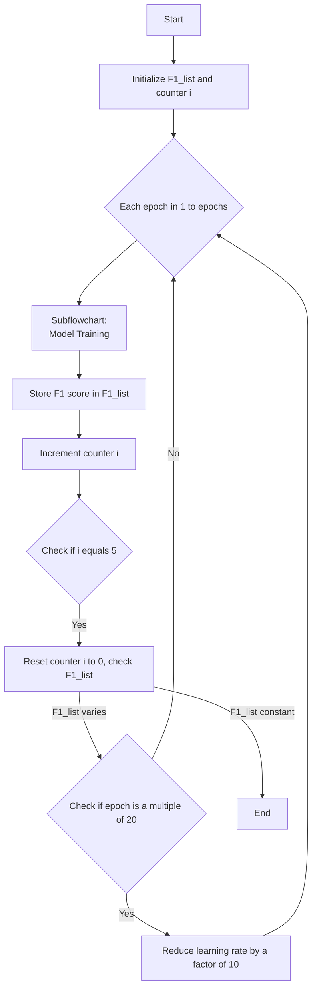
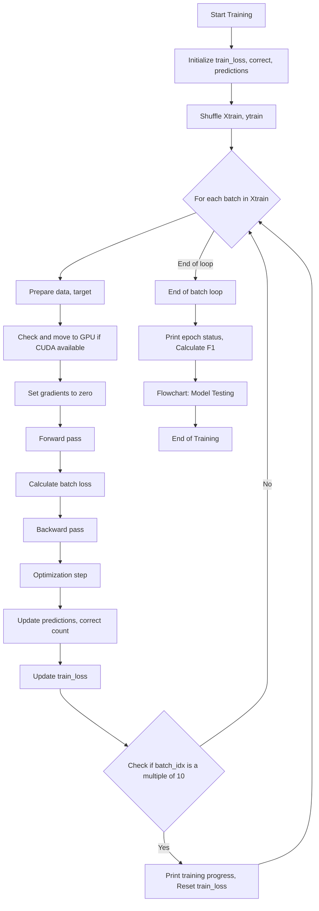
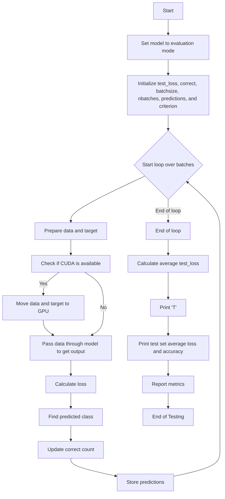
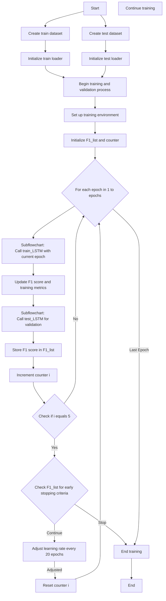
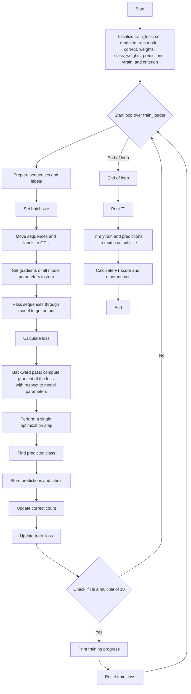
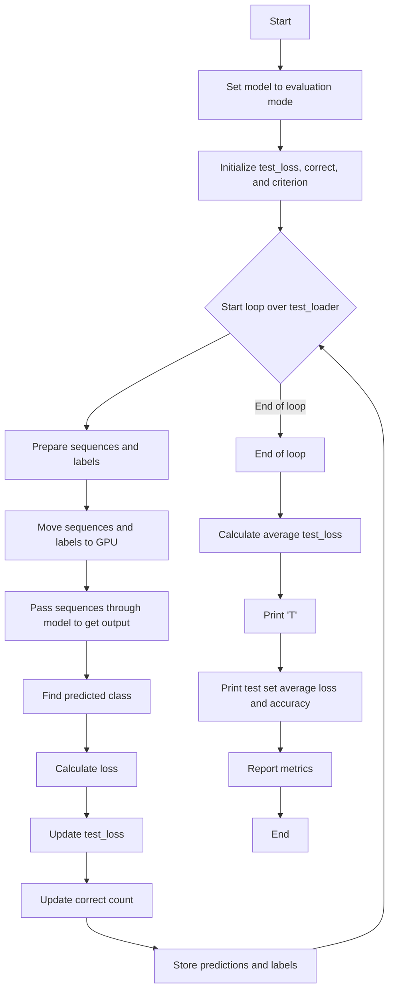

# tcn-hard-disk-failure-prediction

## Table of Contents

- [tcn-hard-disk-failure-prediction](#tcn-hard-disk-failure-prediction)
  - [Table of Contents](#table-of-contents)
  - [Introduction](#introduction)
  - [Code Structure](#code-structure)
  - [Description of each file](#description-of-each-file)
  - [SMART Attributes Selection](#smart-attributes-selection)
    - [Metrics Used](#metrics-used)
    - [Description of Selected Metrics](#description-of-selected-metrics)
  - [Code Process](#code-process)
    - [Main Classification Process](#main-classification-process)
    - [Feature Selection Subflowchart](#feature-selection-subflowchart)
    - [Partition Dataset Subflowchart](#partition-dataset-subflowchart)
    - [Random Forest Classification Process](#random-forest-classification-process)
    - [TCN Classification Process](#tcn-classification-process)
      - [TCN Network Initialization Subflowchart](#tcn-network-initialization-subflowchart)
      - [Iterative Training Process](#iterative-training-process)
      - [TCN Training Subflowchart](#tcn-training-subflowchart)
      - [TCN Testing Subflowchart](#tcn-testing-subflowchart)
    - [LSTM Classification Process](#lstm-classification-process)
      - [Iterative Training Process](#iterative-training-process-1)
      - [LSTM Training Subflowchart](#lstm-training-subflowchart)
      - [LSTM Testing Subflowchart](#lstm-testing-subflowchart)

## Introduction

This repository contains the code to reproduce the experiments of the paper "Predicting Hard Disk Failures in Data Centers using Temporal Convolutional Neural Networks", Burrello et al., Euro-Par 2020.
Please cite the paper as:

@InProceedings{10.1007/978-3-030-71593-9_22,

author="Burrello, Alessio

and Pagliari, Daniele Jahier

and Bartolini, Andrea

and Benini, Luca

and Macii, Enrico

and Poncino, Massimo",

title="Predicting Hard Disk Failures in Data Centers Using Temporal Convolutional Neural Networks",

booktitle="Euro-Par 2020: Parallel Processing Workshops",

year="2021",

publisher="Springer International Publishing",

address="Cham",

pages="277--289",

isbn="978-3-030-71593-9"

}

## Code Structure

The code is structured as follows:
```
tcn-hard-disk-failure-prediction
│
├── algorithms
│   ├── Classification.py
│   ├── Dataset_manipulation.py
│   ├── Networks_pytorch.py
│   └── README.txt
│
└── datasets_creation
    ├── files_to_failed.py
    ├── find_failed.py
    ├── get_dataset.py
    ├── README.txt
    └── toList.py
```

## Description of each file

- `Classification.py`: This script contains the code to train and test various classification models including RandomForest, TCN, and LSTM.

- `Dataset_manipulation.py`: This script is used for manipulating the dataset. It could include tasks such as cleaning, preprocessing, feature extraction, etc.

- `Networks_pytorch.py`: This script contains the implementation of the TCN and LSTM networks using PyTorch.

- `README.txt`: This file provides an overview of the algorithms directory.

- `files_to_failed.py`: This script is used to convert files to a failed state, as part of the dataset creation process.

- `find_failed.py`: This script is used to find and mark failed instances in the dataset.

- `get_dataset.py`: This script is used to fetch and possibly preprocess the dataset for the hard disk failure prediction task.

- `README.txt`: This file provides an overview of the datasets_creation directory.

- `toList.py`: This script is used to convert certain data structures to a list format, possibly for easier manipulation or usage in the project.

## SMART Attributes Selection

### Metrics Used

| SMART | Feature Selected | Attribute Name | Description |
| --- | --- | --- | --- |
| 1 | Yes | Raw read error rate | Rate of hardware read errors that occur when reading data from a disk. |
| 3 | No | Spin-up time | Average time (in milliseconds) of spindle spin up from zero RPM to fully operational. |
| 5 | Yes | Reallocated sectors count | Count of bad sectors that have been found and reallocated. A hard drive which has had a reallocation is very likely to fail in the immediate months. |
| 7 | Yes | Seek error rate | Rate of seek errors of the magnetic heads, due to partial failure in the mechanical positioning system. |
| 9 | Yes | Power-on hours | Count of hours in power-on state. |
| 12 | Yes | Power cycle count | Count of full hard drive power on/off cycles. |
| 183 | Yes | SATA downshift error count | Count of errors in communication between the drive and the host controller. |
| 184 | Yes | End-to-end error | Count of errors in communication between the drive and the host controller. |
| 187 | Yes | Reported uncorrectable errors | Count of errors that could not be recovered using hardware ECC (Error-Correcting Code), a type of memory used to correct data corruption errors. |
| 188 | No | Command timeout | Count of aborted operations due to hard drive timeout. |
| 189 | Yes | High fly writes | Count of times the recording head "flies" outside its normal operating range. |
| 190 | No | Temperature difference | Difference between current hard drive temperature and optimal temperature of 100°C. |
| 193 | Yes | Load cycle count | Count of load/unload cycles into head landing zone position. |
| 197 | Yes | Current pending sectors count | Count of bad sectors that have been found and waiting to be reallocated, because of unrecoverable read errors. |
| 198 | Yes | Offline uncorrectable sectors count | Total count of uncorrectable errors when reading/writing a sector, indicating defects of the disk surface or problems in the mechanical subsystem. |
| 199 | Yes | UltraDMA CRC error rate | Count of errors in data transfer via the interface cable as determined by the CRC (Cyclic Redundancy Check). |

### Description of Selected Metrics

1. **Raw Read Error Rate**
   - This metric quantifies the rate at which the hard drive encounters errors when reading data from the disk surface. It’s an indicator of the physical condition of the disk, where a higher value may suggest a deterioration in disk quality, potentially leading to data loss.

2. **Reallocated Sectors Count**
   - This count reflects the number of sectors on the disk that have been identified as defective and subsequently replaced with spare sectors from the reserve pool. Frequent reallocations can be a precursor to drive failure, as they indicate significant wear or damage to the disk surface.

3. **Seek Error Rate**
   - This rate measures the frequency of errors encountered by the drive's head when trying to reach a specific area of the disk. These errors are often due to mechanical failures within the drive’s moving components or external shocks and vibrations affecting the drive's precise operations.

4. **Power-On Hours**
   - This value records the cumulative number of hours the hard drive has been active. It is used to estimate the age of the drive and assess its wear level, helping predict end-of-life by comparing against typical lifespan estimates for the drive model.

5. **Power Cycle Count**
   - This count logs the number of times the hard drive has been powered up and down. Frequent power cycles can stress the mechanical components of the drive, especially the spindle motor and bearings, reducing the overall lifespan of the device.

6. **SATA Downshift Error Count**
   - This metric tracks the number of times the SATA interface has downshifted from a higher to a lower speed due to errors in data transmission. Persistent errors in downshifting can indicate issues with either the drive’s controller or the SATA cable quality.

7. **End-to-End Error**
   - This error count monitors the data integrity as data is transferred internally between the drive's buffer and its host. Errors here can imply issues with the drive's internal processing or hardware malfunctions that could compromise data integrity.

8. **Reported Uncorrectable Errors**
   - This feature logs the number of errors that could not be fixed using the hardware's error-correcting code. It’s a critical measure of a drive’s ability to maintain data integrity, with high values suggesting a risk of data loss.

9. **Load Cycle Count**
   - This count tracks how often the drive's heads are loaded into the read/write position. Excessive loading and unloading can accelerate wear on the head and the drive medium, potentially leading to drive failure.

10. **Current Pending Sectors Count**
    - This value reports the number of unstable sectors that have yet to be reallocated. Sectors awaiting reallocation can cause data read/write errors and may eventually be marked as bad, affecting data retrieval and overall system performance.

11. **Offline Uncorrectable Sectors Count**
    - This count reflects the number of sectors that failed during offline operations (such as during more intensive scans) and could not be corrected. It indicates problems with the disk surface or with the read/write heads.

12. **UltraDMA CRC Error Rate**
    - This measures the frequency of cyclic redundancy check (CRC) errors during Ultra DMA mode. These errors are usually due to problems with the drive interface or data cable issues and can significantly affect data transfer reliability and speed.

## Code Process

### Main Classification Process



> **TODO:**
> 
> Note 1: We can fix the unbalance of the dataset by using downsampling method to balance the dataset. Specifically, current code use SMOTE method to balance the dataset with 5 as resampler balance ratio. We can change this value to dynamically balance the dataset based on the number of samples in each class.
>
> In conclusion, whether GA or KNN will be better for feature selection depends on your specific use case. If you have a large number of features and you suspect that there may be complex interactions between features, GA might be a better choice. If you have a smaller number of features or computational efficiency is a concern, KNN might be a better choice. It's also worth noting that feature selection is often an iterative and experimental process, and it can be beneficial to try multiple methods and see which one works best for your specific dataset.
>
> Note 2: We can use the Genetic Evolution algorithm for feature selection. Paper reference: **Genetic Algorithm for feature selection in enhancing the hard disk failure prediction using artificial neural network**
>
> Note 3: 

### Feature Selection Subflowchart



### Partition Dataset Subflowchart



### Random Forest Classification Process

This sequence is provided by the third-party library (sklearn), so the process is not detailed here.

### TCN Classification Process

#### TCN Network Initialization Subflowchart



#### Iterative Training Process



#### TCN Training Subflowchart



#### TCN Testing Subflowchart



### LSTM Classification Process

#### Iterative Training Process



#### LSTM Training Subflowchart



#### LSTM Testing Subflowchart

